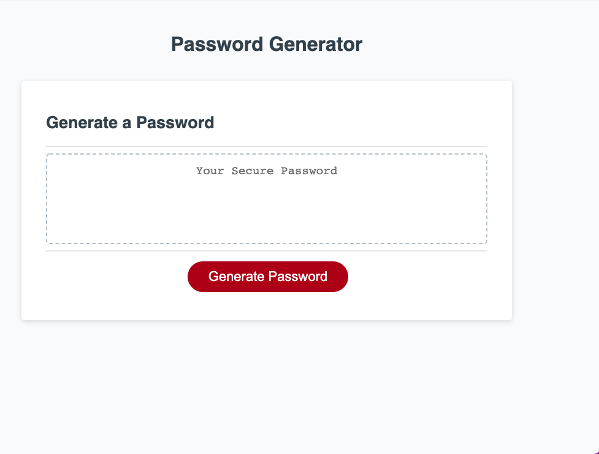
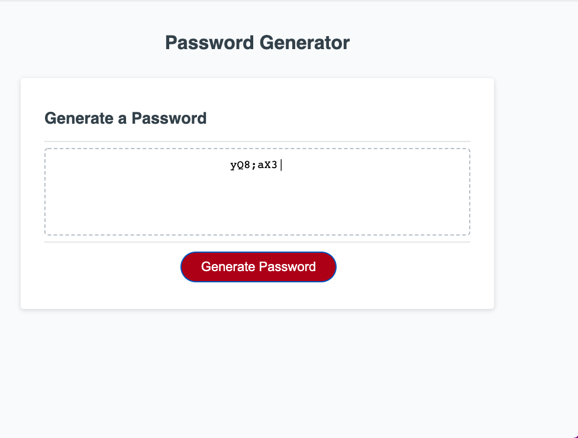

# Password Generator

## Description

This website is an app that is built for employees who are looking to generate secure passwords based on their selected password criteria. This app will help employees to create secure passwords in order to access their sensitive data. This app will run in any browser and it is adapted for multiple screen sites.

## Installation

N/A

## Usage

To use this app you will need to enter the folowin URL into your browser and hit enter: https://marousiss.github.io/password-generator/

Then the Password Generator app will show up on your screen. By clicking on the "Generate Password" button you will be prompted with some password criteria that you need to select from. After done selecting a password will be generated on your screen that you can copy it to use it.

App screenshots:

## Credits

N/A

## License

Please refer to the LICENSE in the repo.
